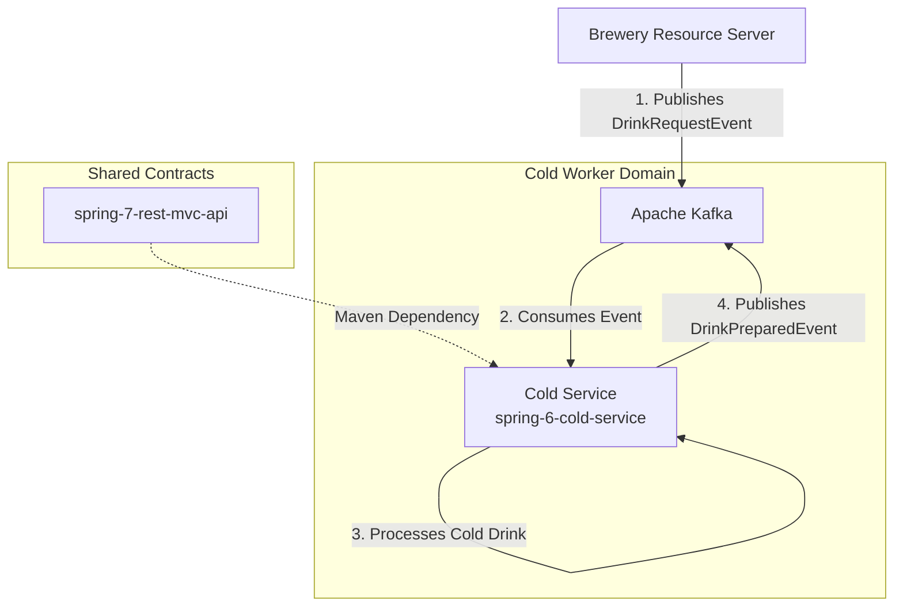

# Cold Drink Service (`spring-6-cold-service`)

> **Course Project:** Built as part of a hands-on microservices ecosystem following John Thompson's *Spring Framework 6 / Spring Boot 3* course.

## Overview

The `spring-6-cold-service` is an event-driven worker microservice within the Brewery ecosystem. It acts as an asynchronous background worker that listens for beverage preparation events published to Apache Kafka and processes cold-temperature drink orders.

It uses `spring-7-rest-mvc-api` to deserialize incoming event payloads and publishes completion events (`DrinkPreparedEvent`) back to Kafka once preparation is finished.

## Key Features

* **Kafka Listener:** Consumes `DrinkRequestEvent` messages asynchronously from Kafka topics.
* **Temperature Filtering:** Filters and processes order lines specifically requiring cold preparation.
* **Event Feedback Loop:** Emits a `DrinkPreparedEvent` back to Kafka to notify the system when drink fulfillment is complete.
* **Shared Data Contract:** Imports `spring-7-rest-mvc-api` for shared DTOs and Kafka event classes.

## Role in Architecture



## Tech Stack & Dependencies

* **Java Version:** 17
* **Framework:** Spring Boot 3
* **Messaging:** Apache Kafka (`spring-kafka`)
* **Shared Library:** `spring-7-rest-mvc-api`
* **Tools:** Lombok, Maven

## Getting Started

### Prerequisites

1. Java 17+
2. Apache Kafka running on port `9092`
3. Local installation of `spring-7-rest-mvc-api` (`./mvnw clean install`)

### Configuration

Kafka listener settings are defined in `src/main/resources/application.yml`:

```yaml
spring:
  kafka:
    bootstrap-servers: localhost:9092
    consumer:
      group-id: cold-service-group
      auto-offset-reset: earliest

```

### Running Locally

```bash
# Clone the repository
git clone [https://github.com/JandierR/spring-6-cold-service.git](https://github.com/JandierR/spring-6-cold-service.git)
cd spring-6-cold-service

# Run the listener service
./mvnw spring-boot:run

```

## Testing

Run unit and listener integration tests using Maven:

```bash
./mvnw test

```
